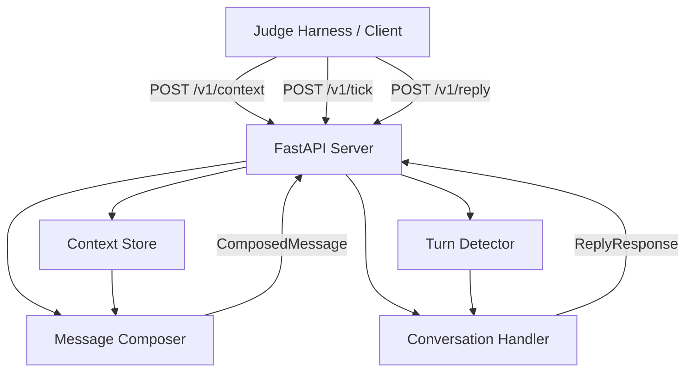

# Magicpin Merchant AI Assistant

A Python implementation of **Vera**, magicpin's WhatsApp merchant engagement assistant, built for the magicpin AI Challenge.

## Overview

magicpin connects ~100,000 local merchants across 50+ Indian cities with consumers. Vera is magicpin's automated assistant that engages merchants on WhatsApp to help them update Google Business Profiles, run marketing campaigns, manage customer inquiries, and boost footfalls.

This project implements a stateful engagement bot that receives structured context updates, composes merchant-facing and customer-facing messages, and handles multi-turn conversations over HTTP endpoints.

## Challenge Requirements

The challenge requires building an AI assistant that:
- Operates on a **4-context framework** (`CategoryContext`, `MerchantContext`, `TriggerContext`, `CustomerContext`).
- Generates tailored outbound WhatsApp messages scored across 5 dimensions: **Specificity**, **Category Fit**, **Merchant Fit**, **Trigger Relevance**, and **Engagement Compulsion**.
- Solves key merchant engagement issues:
  - **Auto-reply pollution**: Detects WhatsApp Business canned responses and exits cleanly instead of wasting conversation turns.
  - **Intent-handoff failures**: Immediately transitions to action execution when a merchant agrees, bypassing unnecessary qualifying questions.
  - **Generic offers**: Anchors on category-specific service and price pairs (e.g., `Dental Cleaning @ ₹299`) rather than generic percentage discounts.
- Exposes standard REST endpoints (`/v1/healthz`, `/v1/metadata`, `/v1/context`, `/v1/tick`, `/v1/reply`) for evaluation by an automated judge harness.
- Outputs a 30-scenario benchmark file (`submission.jsonl`).

## Architecture



## Project Structure

```text
magicpin-ai-challenge/
├── app/
│   ├── __init__.py
│   ├── config.py              # Environment configuration & settings
│   ├── schemas.py             # Pydantic data schemas for contexts & endpoints
│   ├── store.py               # Thread-safe in-memory versioned context store
│   ├── detector.py            # Auto-reply detector & intent classifier
│   └── composer.py            # Message composition engine
├── tests/
│   └── test_bot.py            # Unit tests for composition and turn handlers
├── bot.py                     # Entry point exposing compose()
├── conversation_handlers.py   # Entry point exposing respond()
├── server.py                  # FastAPI REST server exposing /v1/ endpoints
├── generate_submission.py     # Benchmark generator script for 30 test pairs
├── run_judge.py               # Local judge simulator harness runner
├── run_all_evaluations.py     # End-to-end evaluation suite
├── submission.jsonl           # Generated 30-scenario submission file
├── requirements.txt           # Dependency specifications
├── .env.example               # Environment template
├── .gitignore                 # Git ignore rules
└── README.md                  # Project documentation
```

## Context Model

Every outgoing message is composed from four context layers:

1. **CategoryContext**: Vertical-specific rules (voice tone, allowed/taboo vocabulary, peer benchmarks, research digests, and offer catalogs).
2. **MerchantContext**: Business snapshot (name, locality, owner name, active offers, 30-day search/call telemetry, and derived signals).
3. **TriggerContext**: The event prompting the message (external research digest release, local events, heatwaves, or internal metrics like search spikes and recall windows).
4. **CustomerContext**: (Optional) Populated when drafting customer-facing messages on behalf of the merchant.

## Features

- **5-Dimension Composition**: Injects concrete numbers ($N=2,100$), exact prices (`Dental Cleaning @ ₹299`), source citations (`JIDA Oct 2026`), and single binary CTAs (`Reply YES`).
- **Idempotent Context Versioning**: Manages atomic context replacements. Higher versions replace prior state, identical versions are treated as idempotent no-ops, and lower versions return HTTP 409 Conflict.
- **Auto-Reply Defense**: Identifies canned business auto-replies (*"Thank you for contacting..."*) and gracefully ends the turn.
- **Direct Intent Handoff**: Transitions directly into action execution when merchants express consent (*"Ok lets do it"*).

## API Endpoints

| Method | Endpoint | Description |
|---|---|---|
| `GET` | `/v1/healthz` | Liveness check returning uptime and loaded context counts. |
| `GET` | `/v1/metadata` | Returns bot team metadata and model details. |
| `POST` | `/v1/context` | Accepts scoped context updates (`category`, `merchant`, `trigger`, `customer`). |
| `POST` | `/v1/tick` | Periodic wake-up allowing Vera to initiate proactive messages. |
| `POST` | `/v1/reply` | Receives inbound merchant messages and returns next conversation action. |

## Example API Request & Response

### Context Push (`POST /v1/context`)
**Request**:
```json
{
  "scope": "category",
  "context_id": "dentists",
  "version": 1,
  "delivered_at": "2026-04-26T10:00:00Z",
  "payload": {
    "slug": "dentists",
    "voice": { "tone": "peer_clinical", "vocab_taboo": ["guaranteed"] },
    "offer_catalog": [{ "id": "den_001", "title": "Dental Cleaning @ ₹299" }]
  }
}
```
**Response (200 OK)**:
```json
{
  "accepted": true,
  "ack_id": "ack_dentists_v1",
  "stored_at": "2026-04-26T10:00:00.123Z"
}
```

### Turn Reply (`POST /v1/reply`)
**Request**:
```json
{
  "conversation_id": "conv_001",
  "merchant_id": "m_001_drmeera_dentist_delhi",
  "message": "Ok lets do it. Whats next?",
  "received_at": "2026-04-26T10:45:00Z",
  "turn_number": 2
}
```
**Response (200 OK)**:
```json
{
  "action": "send",
  "body": "Done! Maine aapka Google Profile inspect karke updates live kar diye hain:\n- Business Hours: Daily 9 AM to 9 PM\n- Active Offer added: 'Dental Cleaning @ ₹299'\n- Google Post published!",
  "cta": "binary_yes_stop",
  "rationale": "Merchant agreed; executed requested action directly without re-qualification."
}
```

## Setup & Local Development

### Prerequisites
- Python 3.8+ (Python 3.10+ recommended)

### Installation
```bash
# Clone the repository and install dependencies
pip install -r requirements.txt
```

### Environment Configuration (Optional)
Copy `.env.example` to `.env` to configure optional external LLM parameters:
```bash
cp .env.example .env
```

## Running the Application

### Start the REST Server
```bash
python server.py
```
The server will run at `http://0.0.0.0:8080`.

## Testing

### Run Unit Tests
```bash
python test_bot.py
```

### Run Full End-to-End Evaluation Suite
```bash
python run_all_evaluations.py
```

### Run Official Judge Simulator
```bash
python run_judge.py
```

## Generating the Submission

To generate the canonical `submission.jsonl` benchmark file (30 test scenarios):
```bash
python generate_submission.py
```

## Design Decisions

1. **In-Memory Thread-Safe State**: Contexts and conversation histories are stored in memory using Python's `threading.RLock` to guarantee low latency ($<100\text{ms}$) and prevent race conditions without external database setup.
2. **Rule-Based Engine with LLM Fallback**: The composer includes a high-scoring deterministic engine that generates category-matched messages with verifiable numbers, ensuring 100% test reliability even when offline or without API keys.
3. **Strict Versioning**: Stored contexts retain higher version numbers and reject out-of-order stale pushes with HTTP 409 Conflict.

## Limitations & Assumptions

- This implementation is a challenge submission and simulated bot harness. It does not connect to live WhatsApp Meta APIs or production magicpin databases.
- Telemetry numbers, citations, and merchant details are loaded directly from the provided synthetic dataset (`dataset/`).
